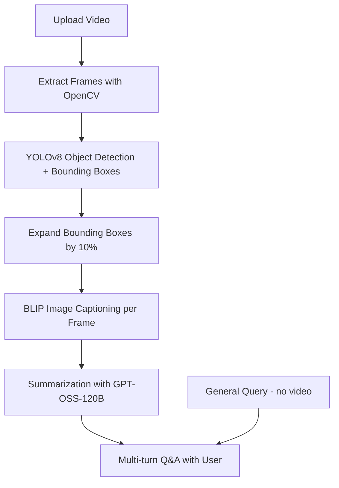

# Video-Question-Answering-System
*Interactive video intelligence powered by AI*<br>
This repository contains an AI-powered system that takes a video as input, processes its content, and enables users to ask questions related to the video. The model analyzes the video, extracts key information, and generates contextually accurate answers in natural language.

---

## 📌 Overview
**Video-Question-Answering-System** is an AI-powered application that allows users to:
1. **Upload a video** → The system processes frames, detects objects, captions them, summarizes the video, and answers user queries about it in a **multi-turn conversation**.
2. **Ask general questions** → Users can also ask queries unrelated to any video, and the system will respond intelligently using an LLM.

This project bridges **computer vision** and **natural language processing** to create an interactive **video-based conversational AI assistant**.

---

## ⚙️ Features
- 🎥 **Video Understanding**: Converts uploaded videos into frames.  
- 🔍 **Object Detection**: Uses YOLOv8 (`yolov8s.pt`) to detect objects with bounding boxes (expanded by 10% each side).  
- 📝 **Image Captioning**: Employs BLIP (`Salesforce/blip-image-captioning-base`) for captioning each frame.  
- 📖 **Video Summarization**: Summarizes captions with `openai/gpt-oss-120b` to extract overall details.  
- 💬 **Conversational AI**: Supports multi-turn dialogue grounded in video context.  
- 🌐 **General Q&A**: Handles queries on any topic without requiring a video.  
- 🎛️ **Streamlit UI**: Simple and interactive browser-based interface.  

---

## 🛠️ Installation

### 1. Clone the Repository
```bash
git clone https://github.com/priyanshkeshari/Video-Question-Answering-System.git
cd Video-Question-Answering-System
```

### 2. Create Virtual Environment (venv)
```bash
python -m venv venv
```

Activate it:
- **Windows**:
  ```bash
  venv\Scripts\activate
  ```
- **Linux/Mac**:
  ```bash
  source venv/bin/activate
  ```

### 3. Install Dependencies
```bash
pip install -r requirements.txt
```

### 4. Setup Environment Variables
Create a `.env` file in the project root and add your keys:
```ini
OPENAI_API_KEY=your_openai_key
GROQ_API_KEY=your_groq_key
HUGGINGFACEHUB_API_TOKEN=your_huggingface_key
```

---

## 📥 Model Downloads

### 🔹 YOLOv8 (Object Detection)
Install Ultralytics and download the model:
```bash
pip install ultralytics
```
The model can be auto-downloaded or explicitly fetched:
```python
from ultralytics import YOLO
model = YOLO("yolov8s.pt")
```

### 🔹 BLIP (Image Captioning)
Hugging Face model will auto-download when first used:
```python
from transformers import BlipProcessor, BlipForConditionalGeneration
processor = BlipProcessor.from_pretrained("Salesforce/blip-image-captioning-base")
model = BlipForConditionalGeneration.from_pretrained("Salesforce/blip-image-captioning-base")
```

### 🔹 OpenAI & Groq Models
Make sure your `.env` file has valid API keys. These models will be accessed via API.

---

## 🔄 Workflow



---

## 🚀 Usage

### Run the Streamlit App
```bash
streamlit run frontend.py
```

### Case 1: Video-based Q&A
- Upload a video in the app.  
- Ask:  
  *“What do you see in the video?”*  
  *“Where is the person standing relative to the car?”*  

### Case 2: General Q&A
- Without uploading a video, just ask:  
  *“Give the important foundations timeline in machine learning.”*  
  *“Who won the FIFA World Cup 2022?”*  

---

## 📸 Screenshots

### 🔹 Uploading Video & Chatting
<br>
<div style="display: inline-flex; gap: 50px;" align="center">
  
   
  
  
  
  
</div>

<br><br>
### 🔹 Asking General Queries
<br>
<div style="display: inline-flex; gap: 50px;" align="center">


</div>


---

## ✅ Local Deployment Only
Currently, the system supports **local usage only** via Streamlit.  
Future updates may include deployment to Hugging Face Spaces or Docker.

---

## 🎯 Conclusion
This project demonstrates the power of combining **Computer Vision** and **Large Language Models** to enable **interactive video understanding and conversational intelligence**.  

Enjoy experimenting with the **Video-Question-Answering-System** 🎥🤖💬
